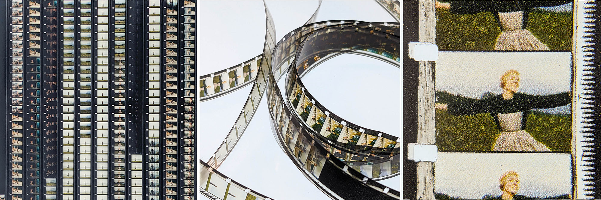

# filmless-simple

A simplified fork of the [filmless](https://github.com/sixteenmillimeter/filmless) toolkit for printing digital video onto projectable 16mm film strips. 

**filmless** is a complete package including Processing sketches, laser cutter templates, calibration functionality, and video conversion scripts. It can be adapted for many workflows, and uses entirely Free Software. 

**filmless-simple** is based on the Processing sketch from filmless, but optimized for one workflow: printing on clear 16mm leader that has been taped to letter-sized paper. filmless-simple assumes that you have access to an NLE (like Adobe Premiere) to prepare the image sequence and sound files. Once you set up Processing (see below) there aren't many choices to make. It generally "just works."

_filmless-simple was developed for a workshop at Cooper Union For the Advancement of Science and Art in March 2025, part of the [Cooper Handmade Cinema](https://handmadecinema.cooper.edu/) project, funded by the [CU Grant Program](https://cooper.edu/academics/research-fellowships/cooper-union-grant-program)._

## How It Works
1. Print the included template file onto card stock (US letter size).
2. Use double-stick tape to attach strips of clear 16mm film to the template.
3. Use an NLE to export a video file as individual frames (+ optional audio file).
4. Use the **filmless_simple.pde** Processing sketch to arrange these files into a page of tiny images that match the template.
5. Load the template+film into the printer and print again.
6. Wait for it to dry, remove the film, and splice it together for projection.
7. Rejoice! You just re-invented the wheel!

## What this repository contains

1. [Processing sketch for generating pages of film strips](#processing)
2. [Required Software & installation instructions](#dependencies)
3. [Step by Step Guide](#guide)
4. [Demo Files](#demo)

## 1. Processing sketch for generating pages of film strips

This Processing sketch will create a printable page of 16mm-sized film strips from an image sequence, optionally containing a generated optical soundtrack. By including a path to a *mono* WAV audio file, this sketch will build an optical soundtrack facsimile using the [SoundtrackOptical](https://github.com/sixteenmillimeter/SoundtrackOptical) library for Processing and sit it in the correct area of the film strip.

The sketch can be modified to accommodate different desired output, **but you don't need to configure anything**. (The defaults are pre-set for printing onto letter-sized paper with sound.)  [Read more about setting the sketch variables.](#variables)

## 2. Required Software

* An NLE to convert a video into image sequence + sound file (Premiere, Resolve, or Free Software Alternatives)
* A photo editor for viewing and printing the pages of "film" (Photoshop, The GIMP, or even MacOS Preview)
* [Processing](https://processing.org/) - [[Download](https://processing.org/download/)] Mac users: Be sure to choose the Apple Silicon or Intel version to match your machine!
* [Sound library for Processing](https://processing.org/reference/libraries/sound/index.html) - Install via Processing library manager ("Sketch menu / Import Library / Library Manager")
* [SoundtrackOptical library for Processing](https://github.com/sixteenmillimeter/SoundtrackOptical) Download from github & unzip, rename folder to "SoundtrackOptical", place in User/Documents/Processing/libraries/

## 3. Step-By-Step Guide

See guide in [Docs folder](https://github.com/z-l-p/filmless-simple/tree/master/docs)

## 4. Demo Files

The [Demo Files folder](https://github.com/z-l-p/filmless-simple/tree/master/demo) contains test frames and audio to try out the process.

